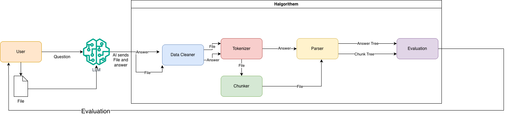
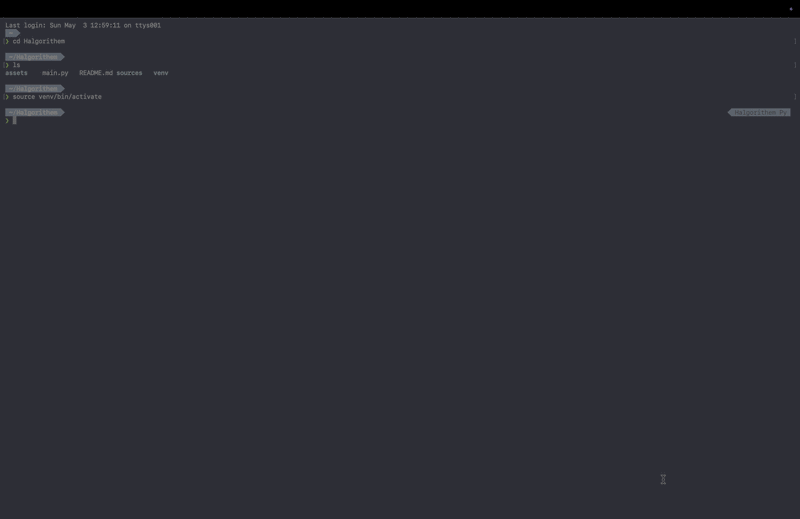

<p align="center">
  
</p>

# Halgorightem

> Detecting AI Hallucinations **Before Them Happening**

## Whats Halgortihem
Halgorithem is a Custom Designed Algorithem For Detecting AI Hallucinations without Little to **Any AI Present in the Algo Itself**. Halgorithem was designed with speed in mind to quickly detect AI Hallucinating

## How does Halgorithem Work
Halgorithem works by Parsing your files and input into a Tree which is compared with file chunks which were made into trees. If something doesn't make sense, Halgorithem Flags it.


## Key Features

- **🔗 Fits Into Any AI workflow where responses are gened** <br>
Halgorithem can be integrated into AI Pipelines designed in python like LangGraph, CrewAI, PydanticAI and Microsoft AutoGen


## Screenshots



## Installation

To run Halgorithem, follow these steps:

1. **Create a virtual environment:**
   ```
   python -m venv venv
   ```

2. **Activate the virtual environment:**
   ```
   source venv/bin/activate
   ```

3. **Install the required modules:**
   ```
   pip install -r requirements.txt
   ```

4. **Download the spaCy English model (if it is not installed automatically):**
   ```
   python -m spacy download en_core_web_sm
   ```

5. **Run the benchmark:**
   ```
   python bench.py
   ```